# Project Blueprint | 项目蓝图

Project: Dental DICOM Privacy Toolkit | 牙科 DICOM 脱敏加密共享工具包

## Positioning

This project will be built as a synthetic-data-only open-source toolkit for dental DICOM privacy workflows. The first usable version should help a clinic, researcher, or developer inventory DICOM folders, preview synthetic images, inspect metadata, identify privacy risk, apply a documented anonymization profile, generate audit reports, and package anonymized files for encrypted sharing.

这个项目不是只做一个脚本，而是做成一个可以展示、可以写论文方法学、可以在 GitHub 上被搜索到的开源工具包。

## Core Idea

The project should prove one thing clearly:

> Dental imaging files can be handled through a reproducible privacy workflow: inventory, preview, inspect, classify risk, anonymize, validate, redact, encrypt, package, audit, and share.

The first phase should avoid heavy web architecture. A strong command-line tool plus static reports is more credible and easier to test. A web demo can come after the core logic is stable.

## Workflow

```mermaid
flowchart LR
    A["Synthetic DICOM input"] --> B["Inventory folder"]
    B --> C["Render PNG preview"]
    C --> D["Inspect metadata"]
    D --> E["Classify privacy risk"]
    E --> F["Apply dental anonymization profile"]
    F --> G["Validate output"]
    G --> H["Redact known pixel region"]
    H --> I["Generate audit report"]
    I --> J["Encrypt sharing package"]
    J --> K["Verify or decrypt package"]
```



## User-Facing Commands

The planned CLI name is `ddpt`, short for Dental DICOM Privacy Toolkit.

```bash
ddpt inventory examples/synthetic-dicom --json reports/inventory.json --csv reports/inventory.csv --html reports/inventory.html
ddpt preview examples/synthetic-dicom/sample.dcm --out reports/sample-preview.png --json reports/sample-preview.json
ddpt tag dump examples/synthetic-dicom/sample.dcm --json reports/tag-dump.json
ddpt inspect examples/synthetic-dicom/sample.dcm --json reports/inspect.json --html reports/inspect.html
ddpt anonymize examples/synthetic-dicom/sample.dcm --profile dental-basic --out outputs/sample.anonymized.dcm --audit reports/audit.json
ddpt package outputs/ --encrypt --manifest reports/manifest.json --out share/dental-dicom-package.zip
ddpt verify share/dental-dicom-package.zip
ddpt decrypt share/dental-dicom-package.zip --out restored/
ddpt demo demo-run
```

## Presentation Forms

### 1. CLI Demo

The CLI is the primary technical proof. It should run locally, be testable in CI, and produce deterministic outputs from synthetic examples.

Best for:

- GitHub visitors
- developers
- technical reviewers
- reproducible paper methods

### 2. Static HTML Report

The HTML report translates DICOM privacy risk into a readable artifact. It can show file summary, risky tags, applied anonymization actions, checksums, and audit events.

Best for:

- dental clinic owners
- research collaborators
- non-programmer readers
- screenshots in README and papers

### 3. README Demo Assets

The GitHub front page should eventually include:

- workflow diagram
- terminal demo screenshot
- sample anonymization report screenshot
- synthetic-only warning
- copyable install and demo commands

### 4. Web Demo Later

After the CLI is stable, add a local-only web dashboard for synthetic DICOM examples. The web UI should not encourage uploading real patient files.

Best for:

- public demos
- videos
- conference slides
- GitHub star conversion

## Languages

### Python

Primary implementation language for the core toolkit.

Reasons:

- mature DICOM ecosystem
- strong CLI and testing support
- easy packaging for research tools
- suitable for metadata processing, reports, and encryption wrappers

### Markdown

Documentation, README, roadmap, safety policy, demo instructions, and paper-facing notes.

### YAML

GitHub Actions and anonymization profile configuration.

### JSON

Machine-readable inspection reports, audit events, manifests, and validation results.

### HTML/CSS

Static privacy and audit reports generated from CLI output.

### TypeScript/React

Optional later web demo, only after the CLI and core workflow are stable.

### Shell

Small development scripts and reproducible demo commands.

## Python Dependencies

### Runtime Dependencies

- `pydicom`: read, inspect, edit, and write DICOM datasets.
- `typer`: command-line interface.
- `rich`: readable terminal tables, panels, and progress output.
- `pydantic`: typed report, manifest, and audit data models.
- `cryptography`: authenticated symmetric encryption for sharing packages.
- `jinja2`: render static HTML reports.
- `numpy`: pixel data normalization and redaction support.
- `pillow`: PNG preview/report assets.
- `pyyaml`: load anonymization profile configuration.

### Development Dependencies

- `pytest`: automated tests.
- `ruff`: linting and formatting.
- `mypy`: optional type checking once the codebase stabilizes.
- `coverage`: test coverage reporting.

### Later or Optional Dependencies

- `opencv-python`: possible future pixel redaction experiments, not first-phase default.
- `fastapi`: possible later API demo.
- `react` or `next`: possible later web dashboard.

## Tools

### Local Development

- Git for version control.
- GitHub for public repository, topics, stars, issues, and releases.
- GitHub Actions for CI checks.
- Codex for implementation, testing, documentation, and repository maintenance.
- Python virtual environment for isolated dependencies.

### Documentation and Diagrams

- Markdown for project documentation.
- Mermaid for workflow diagrams.
- Static HTML reports for non-technical presentation.

### Standards and References

- DICOM PS3.15 Security and System Management Profiles.
- DICOM Attribute Confidentiality Profiles and Basic Application Level Confidentiality Profile.
- pydicom anonymization examples.
- pyca/cryptography Fernet documentation.
- Typer CLI documentation.

## Repository Shape

Planned mature structure:

```text
dental-dicom-privacy-toolkit/
  src/ddpt/
    cli.py
    inventory.py
    inspect.py
    anonymize.py
    preview.py
    profiles.py
    report.py
    package.py
    audit.py
    models.py
  profiles/
    dental-basic.yml
    research-sharing.yml
  examples/synthetic-dicom/
  reports/
  docs/
  tests/
  pyproject.toml
```

## Development Phases

### Phase 0: Blueprint and Safety

- Project blueprint
- Data safety rules
- Discoverability profile
- Synthetic-only boundary

### Phase 1: Python Package and CLI

- Add `pyproject.toml`
- Create `src/ddpt`
- Add `ddpt --help`
- Add CI for lint and tests

### Phase 2: Synthetic DICOM Fixture

- Generate or include synthetic DICOM examples only
- Add checks that no real patient-looking files are committed
- Document how fixtures are created

### Phase 3: Inspection and Risk Report

- Read DICOM metadata
- Classify high-risk, medium-risk, and low-risk tags
- Export JSON report
- Render static HTML report

### Phase 4: Anonymization Profiles

- Add `dental-basic` profile
- Replace or remove risky tags
- Remove private tags by default
- Validate that known sensitive fields are absent or replaced

### Phase 5: Encrypted Sharing Package

- Generate manifest
- Calculate checksums
- Encrypt package
- Verify package integrity
- Produce audit event JSON

### Phase 6: Public Demo

- One-command demo using synthetic data
- README screenshots
- HTML report sample
- GitHub release notes

### Phase 7: Optional Web Dashboard

- Local synthetic-file demo only
- No real patient upload messaging
- Report viewer and workflow explainer

## Safety Rules

- Never commit real DICOM files.
- Never commit patient photos, PDFs, clinic exports, consent forms, or spreadsheets.
- Synthetic examples must be explicitly marked as synthetic.
- Do not claim clinical approval, diagnostic fitness, HIPAA compliance, or regulatory certification.
- De-identification is a risk-reduction workflow, not a guarantee.
- Pixel-level burned-in annotations are a separate risk and should be treated as a later milestone.

## Search and Star Strategy

The repository should repeatedly and accurately include:

- Dental DICOM Privacy Toolkit
- 牙科 DICOM 脱敏加密共享工具包
- DICOM anonymization
- DICOM de-identification
- dental imaging privacy
- medical imaging privacy
- encrypted DICOM sharing
- CBCT privacy
- 牙科影像
- DICOM脱敏
- 医学影像隐私
- 患者隐私保护

The project should grow stars through:

- clear README
- synthetic demo data
- one-command demo
- screenshots and HTML reports
- educational documentation
- practical privacy workflow
- honest scope and safety boundaries

## References

- DICOM PS3.15 Security and System Management Profiles: https://dicom.nema.org/medical/dicom/current/output/html/part15.html
- DICOM Attribute Confidentiality Profiles: https://dicom.nema.org/medical/dicom/current/output/chtml/part15/chapter_e.html
- pydicom anonymization example: https://pydicom.github.io/pydicom/stable/auto_examples/metadata_processing/plot_anonymize.html
- cryptography Fernet documentation: https://cryptography.io/en/latest/fernet/
- Typer documentation: https://typer.tiangolo.com/
